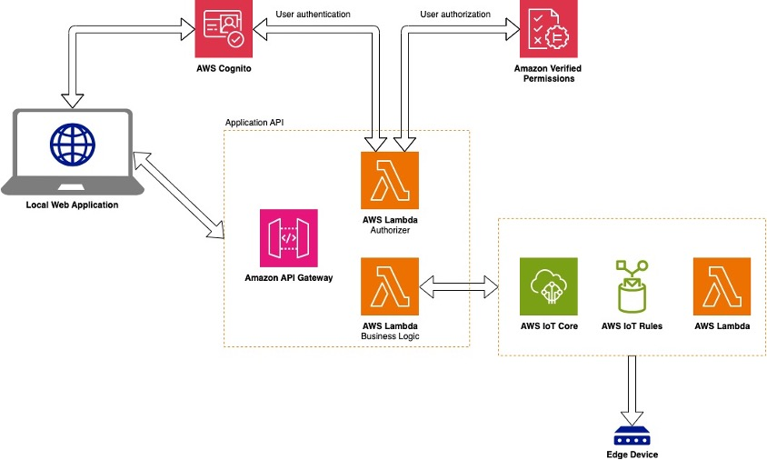
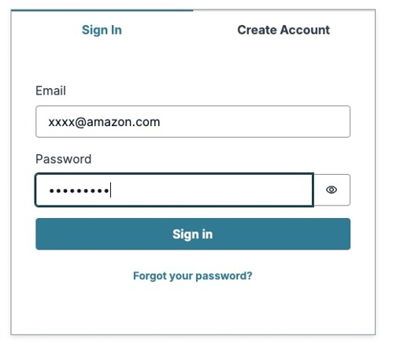
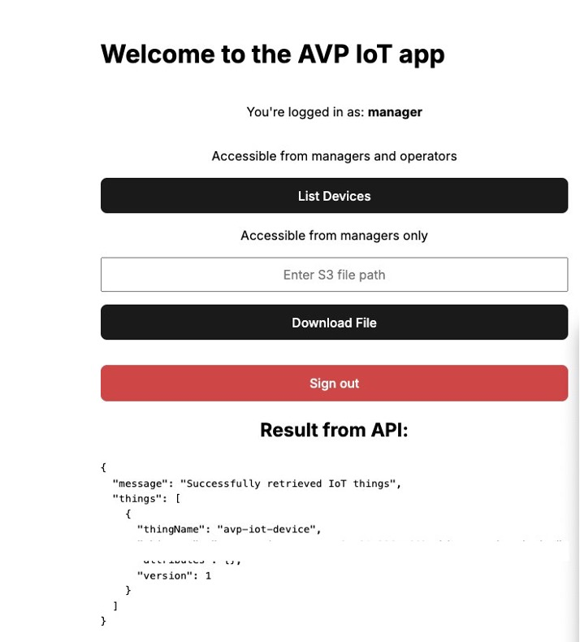
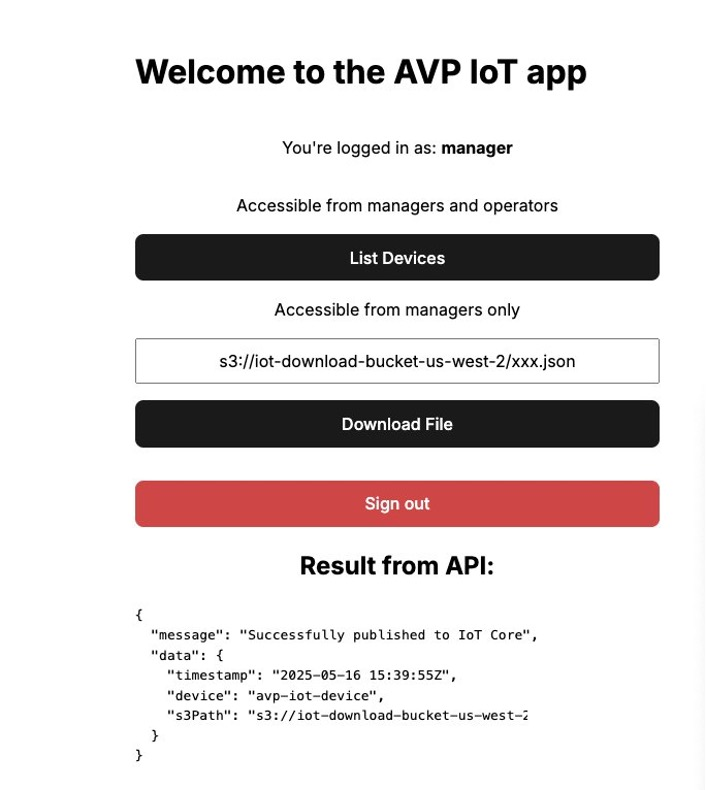

# Secure IoT device management with fine-grained access control using Amazon Verified Permissions

> **For detailed setup instructions and CDK deployment steps, see [SETUP.md](./SETUP.md)**

The Internet of Things (IoT) has wide applications in many industries,
such as manufacturing, agriculture, supply chain, and healthcare. As
organizations scale their IoT deployments, managing secure access
becomes increasingly complex. Consider a large manufacturing facility
with hundreds of connected devices across multiple production lines. The
facility employs maintenance technicians, process engineers, IT staff,
and operations managers---each requiring different levels of access to
these IoT devices.

When a critical machine on Production Line A malfunctions, the facility
needs to make sure that only certified maintenance technicians can
access its diagnostic systems and perform repairs. Meanwhile, process
engineers must be able to modify operational parameters across multiple
production lines but shouldn\'t have access to perform maintenance
tasks. IT staff need to push software updates to devices in specific
zones without disrupting ongoing operations, while operations managers
require comprehensive monitoring capabilities across systems.

This complex web of access requirements presents significant challenges.
Without proper role-based access control (RBAC), organizations risk
unauthorized access to critical systems, potential safety incidents,
compliance violations, and operational inefficiencies. Traditional
approaches to access management become unwieldy as IoT deployments
scale, often requiring custom authorization code for each endpoint and
making it difficult to maintain consistent security policies across the
organization.

Different personnel require different levels of access. An IT technician
might need to send software updates to devices in specific regions,
while operations engineers need to control device operations without
access to firmware updates. Managing these intricate permission
structures while providing both security and operational efficiency has
become a critical challenge for organizations deploying IoT solutions at
scale.

In this post, you learn how to deploy an end-to-end application to
enable fine-grained access control to send out command and control
messages to IoT devices based on a user\'s role. This application uses
several AWS services working together.

- [Amazon
  Cognito](https://aws.amazon.com/pm/cognito)
  -- A user identity and data synchronization service that helps you add
  user sign-up, sign-in, and access control to your applications

- [Amazon Verified
  Permissions](https://aws.amazon.com/verified-permissions/) -- A
  scalable permissions management and authorization service for
  fine-grained access control

- [AWS
  Lambda](https://aws.amazon.com/pm/lambda)
  -- A serverless compute service that you can use to run code without
  provisioning or managing servers

- [Amazon API Gateway](https://aws.amazon.com/api-gateway/) -- A fully
  managed service used to create, publish, and secure APIs

- [AWS IoT Core](https://aws.amazon.com/iot-core/) -- A managed cloud
  platform that lets connected devices interact with cloud applications
  and other devices

- [Amazon Elastic Compute Cloud (Amazon
  EC2)](https://aws.amazon.com/pm/ec2)
  -- A service that provides secure, resizable compute capacity in the
  cloud

- [AWS Identity and Access Management
  (IAM)](https://aws.amazon.com/iam/) -- A service for securely
  controlling access to AWS services and resources

Depending on each user\'s role and allowable permissions, they will be
able to interact with different resources and perform actions directly
from the web application.

## Why Verified Permissions for IoT applications?

[Verified Permissions](https://aws.amazon.com/verified-permissions/)
solves the preceding challenges through centralized, fine-grained
authorization that significantly reduces development time and security
risks. Unlike approaches requiring custom authorization code for each
endpoint, Verified Permissions provides a centralized policy store that
manages permissions across API calls in your Amazon Cognito
authenticated applications.

This centralization delivers substantial value for IoT implementations:

- Significantly reduces development time by eliminating redundant
  authorization code

- Enhances security through consistent access policies across device
  interactions

- Simplifies compliance with centralized audit trails and policy
  versioning

- Enables dynamic permission adjustments without application code
  changes

- Supports complex authorization scenarios using Cedar, the policy
  language of Verified Permissions. With Cedar, you can express
  sophisticated access rules that traditional IAM policies cannot
  handle, such as \"Allow operators to control devices only in their
  assigned region during business hours\" or \"Permit firmware updates
  only for devices with security patches older than 30 days.\"

## Cedar policy language overview

Cedar is the policy language used by Verified Permissions, developed to
address the growing complexity of authorization decisions in modern
applications. It emerged from the need for a more expressive,
maintainable, and scalable authorization solution than traditional
role-based access control systems.

 

Cedar is designed to be human-readable while providing powerful
authorization capabilities that can handle fine-grained permissions
across diverse resources and user contexts. Its importance lies in
enabling developers to implement consistent, auditable authorization
logic that can evolve with changing business requirements without
sacrificing security or performance.

- **Principal** -- The user or service making the request

- **Action** -- The operation is being performed

- **Resource** -- The entity is being accessed

### Basic Cedar policy structure

Cedar policies can be implemented in application code, stored in policy
stores, or managed through Verified Permissions. These policies are
evaluated at runtime when authorization decisions need to be made and
can be integrated with existing identity providers and application data
sources.

```bash
permit (\
    principal,\
    action,\
    resource\
)\
when {\
    conditions\
};
```

### Example Cedar policies for IoT

The following policies demonstrate Cedar\'s ability to express complex
authorization rules based on attributes of the principal, resource,
action, and context. Cedar also supports policy inheritance, scope
restrictions, and other advanced features that make it ideal for IoT
applications with complex permission requirements.

**Example 1: Allow operators to control devices only in their assigned
region**

```bash
permit (\
    principal in UserGroup::\"Operators\",\
    action in \[IoTAction::\"ControlDevice\",
IoTAction::\"ReadDeviceStatus\"\],\
    resource in IoTDevice::\*\
)\
when {\
    principal.assignedRegion == resource.region\
};
```

**Example 2: Allow firmware updates only during maintenance windows**

```bash
permit (\
    principal in UserGroup::\"Technicians\",\
    action == IoTAction::\"UpdateFirmware\",\
    resource in IoTDevice::\*\
)\
when {\
    context.currentTime.hour \>= 22 \|\| context.currentTime.hour \< 4\
};
```

**Example 3: Allow emergency access to critical devices**

```bash
permit (\
    principal in UserGroup::\"EmergencyResponse\",\
    action in IoTAction::\*,\
    resource in IoTDevice::\*\
)\
when {\
    context.request.emergency == true &&\
    resource.criticality == \"high\"\
};
```

[AWS IoT Core](https://aws.amazon.com/iot-core/) provides the cloud
services that connect your IoT devices to other devices and AWS cloud
services. When combined with Verified Permissions, you get a powerful
solution for implementing secure, role-based access control for your IoT
fleet.

## Prerequisites

Before getting started with this solution, make sure that you have the
following resources and tools available:

- AWS account

  - An active [AWS account](https://aws.amazon.com/free)

  - An IAM user or role with appropriate permissions

  - AWS credentials properly configured on your local machine

- [AWS CDK
  prerequisites](https://docs.aws.amazon.com/cdk/v2/guide/getting_started.html)

  - [Git](https://git-scm.com/downloads)

  - [Npm](https://docs.npmjs.com/downloading-and-installing-node-js-and-npm)

  - Basic understanding of TypeScript and Python

## Solution architecture



Figure 1: IoT device management solution architecture

Figure 1 shows the following solution flow:

1.  A local web application authenticates users using Amazon Cognito

2.  Requests pass through API Gateway to a Lambda authorizer, which
    evaluates permissions

3.  Verified Permissions determines the authorization level based on the
    user group

4.  Authorized requests are routed to Lambda functions that handle
    business logic

5.  AWS IoT Core manages device communication based on IoT Rules

6.  Edge devices receive and respond to authorized commands

## Solution walkthrough

To demonstrate this solution, let\'s explore a hypothetical scenario in
a manufacturing plant. In this example, maintenance technicians can be
granted access only to the specific production line machinery they are
certified to service, while process engineers can be given permissions
to modify operational parameters across multiple production lines but
without the ability to perform maintenance tasks. This granular control
helps make sure that equipment is only accessed and operated by
qualified personnel, improving both safety and operational efficiency.

### User personas: Administrators and operators

For this post, we've designated two groups of users to simulate access
level: managers and operators. The idea is that managers should have
access to every resource, while operators should only have access to a
subset of resources. The grouping of such entities happens in Amazon
Cognito. When you add users to groups in Amazon Cognito, they
automatically receive the permissions assigned to those groups. This
works because Verified Permissions handles the authorization process.
The system is set up with Cognito as the source of user identity
information, which means that Verified Permissions can check a user\'s
group membership to determine what they\'re allowed to do. This approach
uses the scalable, fine-grained permissions management capabilities of
Verified Permissions for custom applications. This can be helpful when
managing permissions at scale because now you have a single API call
being made to determine access level.

### User authentication flow

To understand how the solution secures access to IoT devices, it\'s
important to first examine how users are authenticated. The following
steps outline the authentication process:

1.  A user initiates the process by accessing the local web application

2.  The web application communicates with Amazon Cognito for
    authentication

3.  Upon successful authentication, Amazon Cognito returns a JWT token
    containing metadata about the user, including which group they
    belong to

4.  The token is stored in the browser to persist the session

### Permission boundary resolution

After a user is authenticated, the system must determine what actions
they're authorized to perform. This authorization process is critical to
implementing role-based access control and works as follows:

1.  The web application sends a request to API Gateway including the JWT
    token to:

    a.  List IoT devices (/GET)

    b.  Download File (/POST)

2.  API Gateway endpoints are protected by a Lambda authorizer

3.  The Lambda authorizer queries Verified Permissions to determine if a
    user has permission to access the endpoint

4.  Verified Permissions returns an allow or deny IAM policy, dictating
    access to the Lambda function configured on the API endpoint as an
    integration request

5.  The web application receives and processes the API\'s response based
    on the Verified Permissions outcome:

    a.  If the user is allowed to access a resource, the application
        will display the result of the API call

    b.  If the user is not allowed to access a resource, the application
        will display an access denied error

### Edge device command execution

After authorization is confirmed, commands can be securely sent to IoT
devices. This process demonstrates how the entire solution works
end-to-end:

1.  A user initiates a remote action through the UI

2.  The web application sends a request to API Gateway

3.  The request undergoes permission validation through Verified
    Permissions

4.  The AWS IoT Core API processes the validated request

5.  AWS IoT Core receives the command and converts it to an MQTT message

6.  The edge device receives the MQTT message and executes the required
    action

### Key implementation considerations:

When implementing this solution, you must address several important
factors to help ensure security, performance, and reliability. For
security, the solution implements JWT token validation, Verified
Permissions checks for actions and endpoints, and secure MQTT
communication with edge devices. Scalability is achieved through
serverless architecture components, AWS IoT Core support for millions of
devices, and efficient permission boundary caching. Monitoring
capabilities include [Amazon
CloudWatch](https://aws.amazon.com/cloudwatch/) integration for logging,
AWS IoT Core metrics for device communication, and API Gateway request
tracking. These considerations work together to create a robust, secure,
and scalable IoT access control system.

## Deploy the solution

### Clone the repository

- Steps to clone the github repo
  <https://github.com/aws-samples/sample-avp-iot-demo>

git clone <https://github.com/aws-samples/sample-avp-iot-demo>

### Deploy the CDK stacks

Follow the detailed setup instructions in the
[SETUP.md](./SETUP.md)
file for complete CDK deployment steps, including virtualenv setup, dependencies installation, and stack deployment.

## Set up the user permission on AWS Console

With the solution in place, the next step is to set up and test a user.

**To create an Amazon Cognito user:**

1.  Go to the AWS Management Console for [Amazon
    Cognito](https://console.aws.amazon.com/cognito).

2.  Locate and select the user pool created using the AWS CDK.

3.  On the left side panel, select **Users**.

4.  On the top right, choose **Create User**.

    a.  Select **Don\'t send an invitation** for the invitation message.

    b.  Enter your email address in the **Email Address**.

    c.  Enter a password for the user.

    d.  Choose **Create User**.

**Note**: You will be prompted to change your password upon first sign
in to the application

**To add an Amazon Cognito user to a group:**

1.  Go to the [Amazon Cognito
    console](https://console.aws.amazon.com/cognito).

2.  Select the user pool created using the AWS CDK.

3.  On the left side panel, select **Groups**.

4.  Select the **manager** group.

5.  On the right, choose **Add user to group**.

6.  Select the previously created user, and choose **Add**.

### Important notes:

- The user has now been added to the manager group. You can repeat the
  same process for the operator group, but make sure that a user is only
  a member of either manager or operator, not both.

- The group information for a user is contained in the JWT token issued
  on each sign-in. A sign-out is required to reset the group tied to a
  user.

### IoT device testing (for manager role)

The next step is to verify that the IoT device correctly receives and
processes commands from authorized users.

**To test the MQTT communication channel:**

1.  Sign in to the [Amazon EC2](https://console.aws.amazon.com/ec2/)
    instance using [Session Manager, a capability of AWS Systems
    Manager](https://docs.aws.amazon.com/systems-manager/latest/userguide/session-manager.html)
    that lets you manage your Amazon EC2 instances through an
    interactive one-click browser-based shell or through the [AWS
    Command Line Intervace (AWS CLI)](https://aws.amazon.com/cli).

2.  Execute the following commands:

    a.  sudo su

    b.  python3 /home/ec2-user/device_code/local_subscribe.py \--topic
        my/custom/topic \--client-id avp-iot-device

        i.  Replace my/custom/topic and avp-iot-device with names used
            for IoT topic name and IoT Thing name while deploying
            IoTThingStack

        ii. if the script returns an error for disconnect or connects to
            the us-east-1 endpoint while the stack is deployed in
            another AWS Region, make sure that you set export
            AWS_DEFAULT_REGION="*\<Stack* *Region* *name\>*" For
            example us-west-2.

    c.  View the downloaded file Expected Output:

```
Initializing IoT subscriber...
Connected to MQTT broker
Subscribing to topic: my/custom/topic
Subscribed to topic: my/custom/topic
```

**Note**: This testing procedure validates the integration between
Amazon Cognito authentication, AWS IoT Core MQTT messaging, [Amazon
Simple Storage Service (Amazon S3)](https://aws.amazon.com/s3/) file
access, and Amazon EC2 instance communication. The following response
shows a correct MQTT message received and processing.

## Test the solution

After deploying the solution, it\'s important to verify that the
role-based access control is working correctly. The following tests will
help you confirm that users with different roles can only access the
resources and perform actions according to their permissions. This
validation verifies that your security implementation is functioning as
designed.

**To test the web application:**

1.  Sign in to the application as either a manager or operator using the
    credentials created in your [Amazon
    Cognito](https://aws.amazon.com/cognito/) user setup.



Figure 3: Web application sign-in page

2.  After signing in, you will be presented with a simple UI displaying
    two buttons that are accessible by specific groups:

    a.  The **List IoT devices** button is accessible by both managers
        and operators, and returns a list of IoT devices from AWS IoT
        Core



Figure 4: Page showing available options

b.  The **Download File** button is only accessible by managers and,
    when chosen, sends an MQTT message containing the [Amazon
    S3](https://aws.amazon.com/s3/) path specified in the input box to
    the IoT device configured through [Amazon
    EC2](https://aws.amazon.com/ec2/).



Figure 5: Result of choosing **Download File**

## Best practices

Some best practices to follow if you choose to deploy this solution as
part of your projects:

- **Device Communication Reliability** -- Implement retry mechanisms
  following the [AWS IoT Core best
  practices](https://docs.aws.amazon.com/iot/latest/developerguide/security-best-practices.html)
  to help ensure consistent device connectivity. Configure appropriate
  timeout settings to balance quick failure detection and allowing
  sufficient time for operations to complete successfully.

- **Permission Management** -- Cache permission boundaries from Amazon
  Verified Permissions to reduce API calls and improve application
  responsiveness. Implement efficient permission validation strategies
  that minimize latency while maintaining security. Always apply the
  [least privilege
  principle](https://docs.aws.amazon.com/%20%20IAM/latest/UserGuide/best-practices.html#grant-least-privilege)
  when assigning permissions to limit potential security risks.

- **Monitoring and Observability** -- Implement comprehensive device
  status monitoring using [Amazon
  CloudWatch](https://docs.aws.amazon.com/AmazonCloudWatch/latest/monitoring/Best-Practice-Alarms.html)
  to maintain visibility into system health. Monitor connection status
  and device activity patterns to detect anomalies before they impact
  operations. Create dashboards for real-time device monitoring to
  provide stakeholders with actionable insights.

## Next steps

To learn more about the technologies used in this solution, consider the
following resources and development paths:

- **Learn more about Verified Permissions** -- Explore [Verified
  Permissions
  documentation](https://docs.aws.amazon.com/verifiedpermissions/latest/userguide/what-is-avp.html)
  to deepen your understanding of policy modeling and evaluation
  techniques. The documentation provides valuable insights into policy
  store management, best practices for permission schemas, and advanced
  authorization patterns that can help you optimize your access control
  implementation.

- **Deploy to AWS Amplify** --Take your application to the next level by
  extending it with [AWS Amplify](https://aws.amazon.com/amplify).
  Setting up Amplify hosting provides a streamlined way to deploy your
  web application with built-in continuous integration and delivery
  (CI/CD) pipelines for automated deployments. You can implement
  additional API endpoints to expand functionality and add monitoring
  and analytics to gain insights into application usage and performance.

- **Security enhancements** -- Continue strengthening your security
  posture by implementing additional authentication methods beyond the
  basic implementation. Further refine your fine-grained access controls
  to address evolving organizational needs. Set up comprehensive
  security monitoring and alerting to provide early warning of potential
  security incidents and implement detailed audit logging to support
  compliance requirements and security investigations.

## Conclusion

In this post, you learned how to implement RBAC for IoT devices using
Verified Permissions and AWS IoT Core. The solution showcases how you
can securely manage access to IoT devices by different user roles, such
as managers and operators, with fine-grained permissions.

The implementation uses several AWS services working together
seamlessly:

- Amazon Cognito for user authentication and group management

- Amazon Verified Permissions for scalable, fine-grained authorization

- AWS IoT Core for device connectivity and message routing

- Amazon API Gateway and AWS Lambda for secure API endpoints

## Author bios

**Davide Merlin Davide**

David is a Delivery Consultant at AWS Professional Services based in
Jersey City. He specializes in backend development of cloud-native
applications, with a focus on API architecture. In his free time, he
enjoys playing video games, trying out new restaurants, and watching new
shows.

**Joyson Neville Lewis**

[Joyson](https://www.linkedin.com/in/joyson-lewis) is a Sr.
Conversational AI Architect with AWS Professional Services. Joyson
worked as a Software/Data engineer before diving into the Conversational
AI and Industrial IoT space. He assists AWS customers to materialize
their AI visions using Voice Assistant/Chatbot and IoT solutions.
